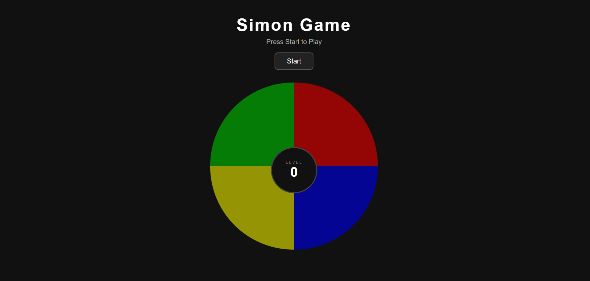

# Simon Game — Boss Level Challenge 02

Live Demo: https://sahranhameed.github.io/The-Simon-Game/

## About the Project

A browser-based memory pattern game inspired by the classic Simon electronic toy, built with HTML, CSS, JavaScript, and jQuery as part of the MERN Stack Development training — Boss Level Challenge 02.

---

## How to Play

1. Open `index.html` in your browser
2. Press any key (or tap/click the screen) to start
3. Watch which color flashes and listen to the beep sound
4. Click the same color to repeat the pattern
5. Each level adds one more color to the sequence
6. Wrong click = Game Over — press any key to restart!

---

## Features

- 4 colored buttons: Green, Red, Yellow, Blue
- Unique beep sound for each color (Web Audio API — no files needed!)
- Pattern grows longer every level
- Game Over animation with red screen flash
- Level counter in the center circle
- Works on desktop and mobile

---

## Technologies Used

| Technology     | Purpose                            |
|----------------|------------------------------------|
| HTML5          | Game structure and layout          |
| CSS3           | Styling, glow effects, animations  |
| JavaScript ES6 | Game logic and pattern generation  |
| jQuery         | DOM manipulation, event handling   |
| Web Audio API  | Sound generation for each button   |

---

## Project Structure

```
simon-game/
├── index.html      # Main HTML file
├── style.css       # Styling and animations
└── index.js        # Game logic (jQuery)
```

---

## Getting Started

```bash
# Clone the repository
git clone https://github.com/SahranHameed/The-Simon-Game.git

# Open in browser
cd The-Simon-Game
open index.html
```

Note: Requires an internet connection to load jQuery from CDN.

---

## Game Logic Flow

```
Start → Flash Color + Sound
      → User Clicks → Check Answer
      → Correct?  Yes → Add 1 Color → Next Level → Repeat
      → Correct?  No  → Game Over → Press Any Key → Restart
```

---

## Screenshot



---

## Author

**Sahran Hameed**
- GitHub: [@SahranHameed](https://github.com/SahranHameed)
- LinkedIn: [Sahran Hameed](https://www.linkedin.com/in/sahran-hameed/)
- Portfolio: [sahranhameed.github.io](https://sahranhameed.github.io/My-Portfolio/)

---

## License

This project is open source and available under the [MIT License](LICENSE).

---

⭐ **If you like this project, give it a star!** ⭐
